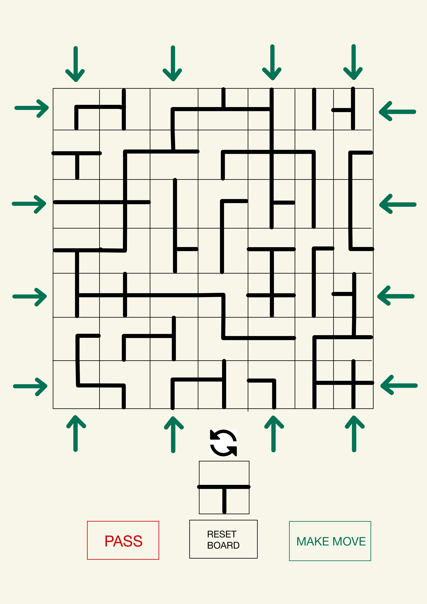

**TO:** Dot Game Company CEOs  
**FROM:** Can Ivit and Luka Jovanovic   
**DATE:** October 26, 2022  
**SUBJECT:** Interactive Player

## The GUI Design:

## The Program Design:
```csharp
// Represents a view a player can use to observe the game and make moves
public interface IView
{
  public void PushState(IState state);
}

// Reprsents high-level events that can be triggered by an IView
public interface IEvents
{
  // The view will raise this event when the player interactively decides how to move
  public void MakeMove(Option<IMove> maybeMove);
}

// Represents a controller that an interactive player (that implements the IPlayer protocol based on logical interactions) can delegate to
public interface IController
{
  public Task<Option<IMove>> TakeTurn(IState state);
}
```

Based on these interfaces, potential implementations may look like this:
```csharp
// Both the view and the player will have a reference to this class.
// The view will interact through the IEvents interface while the player will interact through the IController interface
public class Controller : IEvents, IController
{
  // The view raises this event on this controller
  public void MakeMove(Option<IMove> maybeMove)
  {
    ...
  }

  // The player delegates its TakeTurn to this method
  public Task<Option<IMove>> TakeTurn(IState state)
  {
    ...
  }
}

public class GuiView : IView
{
  private readonly IEvents _events;

  public GuiView(IEvents events)
  {
    _events = events;
  }

  public void PushState(IState state)
  {
    ...
  }
}

public class InteractivePlayer : IPlayer
{
  private readonly IController _controller;

  public InteractivePlayer(IController controller)
  {
    _controller = controller;
  }

  ...

  public Task<Option<IMove>> TakeTurn(IPlayerState state)
  {
    return _controller.TakeTurn(state);
  }
}
```